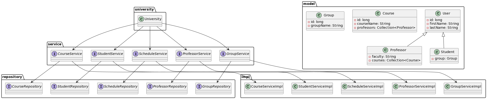

## Getting Started

To ensure the proper functioning of the project, follow these steps

1. Start Docker for easy environment setup:

    ```bash
    docker-compose up
    ```

  
2. Run the project

### 3. Accessing the Application

After successfully starting your application with Docker, open your web browser.
Navigate to: http://localhost:8080/
Here, you will find your application up and running.

### 4. Login Credentials <br>
####   Admin Panel <br>
Username: admin <br>
Password: admin <br>
####   Student Panel <br>
Username: student <br>
Password: student <br>
####   Professor Panel <br>
Username: professor <br>
Password: professor <br>
####   Professor Panel <br>
Username: stuff <br>
Password: stuff <br>


## Other Important Steps

**User Stories:**

1. **Teacher Views Daily Timetable:**
    - *Given* the user is logged in as a teacher.
    - *When* the user navigates to the "My Schedule" menu.
    - *Then* the user should see and navigate their daily schedule for the selected date.

2. **Teacher Views Monthly Timetable:**
    - *Given* the user is logged in as a teacher.
    - *When* the user accesses the "My Schedule" menu.
    - *Then* the user should be able to view and navigate their monthly schedule for the selected month and year.

3. **Student Views Daily Timetable:**
    - *Given* the user is logged in as a student.
    - *When* the user goes to the "My Schedule" section.
    - *Then* the user should see and navigate their daily schedule for the selected date.

4. **Student Views Monthly Timetable:**
    - *Given* the user is logged in as a student.
    - *When* the user visits the "My Schedule" area.
    - *Then* the user should have the ability to view and navigate their monthly schedule for the selected month and year.
