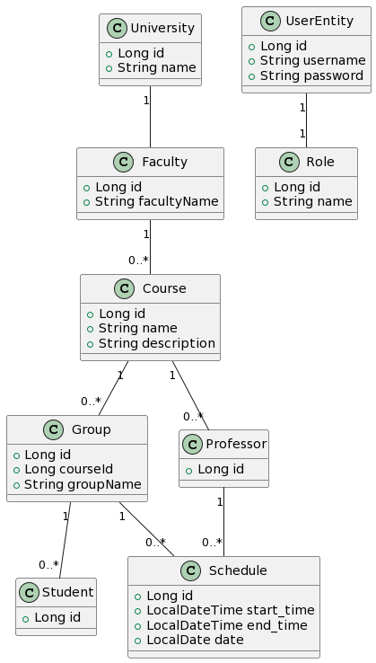

## Getting Started

To ensure the proper functioning of the project, follow these steps

1. Start Docker for easy environment setup:

    ```bash
    docker-compose up
    ```


2. Run the project

### 3. Accessing the Application

After successfully starting your application with Docker, open your web browser.
Navigate to: http://localhost:8080/
Here, you will find your application up and running.

### 4. Login Credentials <br>

#### Admin Panel <br>

Username: admin <br>
Password: admin <br>

#### Student Panel <br>

Username: student <br>
Password: student <br>

#### Professor Panel <br>

Username: professor <br>
Password: professor <br>

#### Professor Panel <br>

Username: stuff <br>
Password: stuff <br>

## Other Important Steps

**User Stories:**

1. **Anonymous:**
    - *Given* the user is not logged in.
    - *Then* they can **read** all courses with basic information.
    - *When* the anonymous user navigates to another menu, they are prompted to log in.


2. **Admin:**
    - *Given* the user is logged in as **Admin**.
    - *Then* they can **read** universities information.
    - *Then* they can **read, update** professors / students information.
    - *Then* they can **read, create, update, delete** courses / groups / faculties / schedules / users information.


3. **Stuff:**
    - *Given* the user is logged in as **Stuff**.
    - *Then* they can **read**, universities information.
    - *Then* they can **read, update** professors / students information.
    - *Then* they can **read, create, update** courses / groups / faculties / schedules / users information.


4. **Professor:**
    - *Given* the user is logged in as **Professor**.
    - *Then* they can **read** information about universities / professors / students / courses / groups / faculties /
      schedules.
    - *Then* they can **read** their own schedule.


5. **Student:**
    - *Given* the user is logged in as **Student**.
    - *Then* **read** information about universities / professors / students / courses / groups / faculties / schedules.
